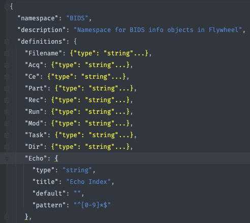

# Debug BIDS Curation

## Add a new acquisition type from the BIDS Specification

To add a new modality conforming to the BIDS specification, one needs to define the entities (in order), a rule, and regular expressions. 

### Microscopy example (see [Section 10-microscopy](https://bids-specification.readthedocs.io/en/stable/04-modality-specific-files/10-microscopy.html) of the Specification)
For the "definitions" section of the template, one would add:
1) a new "micr_file" that has a "micr/" folder (like "anat/" "func/" etc.).
2) a new "_sample-<label>" key-value pair (e.g., a "Sample" definition + "properties":{"Sample": {"$ref": "#/definitions/Sample"} + "Filename" "auto_update":sub-xxx[_ses-yyy][_sample-{session.info.BIDS.Sample])
3) many new modality suffixes (2PE, BF, CARS, CONF, DIC, etc.)
4) applicable file extensions (png, tif, ome.tif, ome.btf, and ome.zarr)  

Additional optional filename entities would also need to be added to the definitions like "stain", "chunk", etc.  
For the "rules" section of the template, create:
1) a rule to match specific file name conventions (a ReproIn-like convention could be developed)
2) specific regular expressions to find the values for the new entities.  

To develop and test the new sections of the project curation template, you must use a set of example files.

### MEGRE and MESE example
### Modifying the "anat_file" definition in the template
Adding new types of anatomical scans, Multi-echo Gradient Recalled Echo (MEGRE) and Multi-echo Spin Echo (MESE), to the existing "anat_file" MRI definition involves only adding two lines  ("MEGRE" and "MESE") to the "enum" list here for the "Modality" because the rest of the template still applies:

```json
        "Modality": {
          "type": "string",
          "title": "Modality Label",
          "default": "",
          "enum": [
            "angio",
            "defacemask",
            "FLAIR",
            "FLASH",
            "inplaneT1",
            "inplaneT2",
            "MEGRE",
            "MESE",
            "M0map",
            "PD",
            "PDmap",
            "PDT2",
            "R2map",
            "SWImagandphase",
            "T1w",
            "T2w",
            "T1rho",
            "T1map",
            "T2map",
            "T2star"
          ]
        },
```
### How BIDS import/curation handles special cases
When adding a new type of acquisition to the template, most of the BIDSification is based on the acquisition label. However, some special cases, such as multi-echo, must also rely on the file name for proper conversion.  

For MRI, the initial file (re)naming is mainly handled by `dcm2niix` which was designed to convert DICOMs to NIfTI for BIDS formatting.  In the case of MEGRE and MESE scans, `dcm2niix` creates multiple NIfTI files with names like "anat_MEGRE_acq_T1MEPREINT_e1.nii.gz", "anat_MEGRE_acq_T1MEPREINT_e2.nii.gz", etc.  The corresponding BIDS name would spell out "_echo-1", "_echo-2", etc. entities in the file name.  When adding MESE and MEGRE, no further edits to the template were required. "Echo" is part of the "definitions"
  
and follows an index. Therefore, the "reproin_anat_file" rule was already set up to use the definitions ("anat_file" and "Echo") to find the digit corresponding to the echo and place it in the echo entity of the file name accordingly.