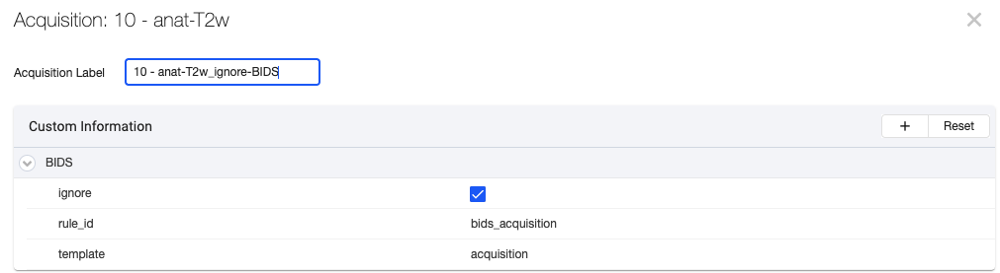
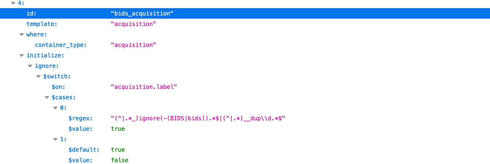
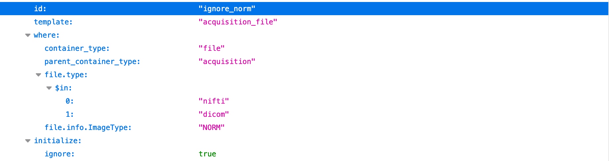
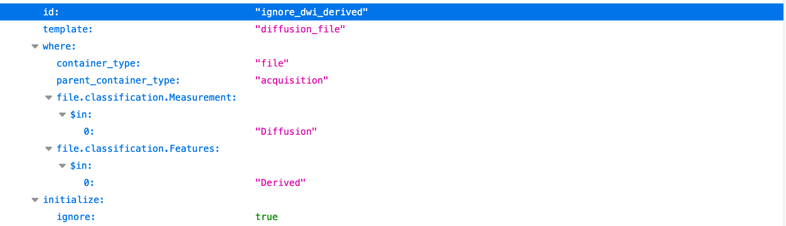

# Debug BIDS Curation

## Add an ignore rule to a template
The template engine traverses the Flywheel hierarchy, matching and extracting metadata which matches the text strings in the project curation templates. In some cases, a set of scans, sessions, or subjects should be ignored, skipped during the renaming to BIDS spec and excluded from any algorithmic processing. Because the template engine's implementation is very flexible and powerful, one can add a Flywheel-specific final entity, "_ignore-BIDS", to specify the set to skip. During template processing, this final entity will set the ignore boolean to true, which will stop renaming that container and keep the container from being downloaded/exported when the BIDS-specific dataset is requested.

### Ignore a subject or session
Below is an example showing how to ignore entire subjects and sessions. By putting "_ignore-BIDS" in the session or subject label, the template will toggle the ignore boolean when the "initialize" regex condition is encountered:

```json
        {
            "id": "bids_session",
            "template": "session",
            "where": {
                "container_type": "session"
            },
            "initialize": {
                "ignore": {
                    "$switch": {
                        "$on": "session.label",
                        "$cases": [
                            {
                                "$regex": "(^|.*_)ignore(-(BIDS|bids)).*$",
                                "$value": true
                            },
                            {
                                "$default": true,
                                "$value": false
                            }
                        ]
                    }
                },
                "ignore": {
                    "$switch": {
                        "$on": "subject.label",
                        "$cases": [
                            {
                                "$regex": "(^|.*_)ignore(-(BIDS|bids)).*$",
                                "$value": true
                            },
                            {
                                "$default": true,
                                "$value": false
                            }
                        ]
                    }
                }
            }
        },
```

### Ignore an acquisition container
String matches are most commonly tested against the metadata field, `acquisition.label`.  This field is the text label of the acquisition container where files, usually a DICOM and a NIfTI file, are attached. One can ignore all files in an acquisition by adding a template rule that looks for "_ignore-BIDS" at the end of `acquisition.label`. Here is an example of ignoring an entire acquisition in the UI.



Here is the rule for acquisition containers in the default ReproIn project curation template:


The rule is executed for every acquisition container.  When recognized, the above "initialize" section says to set the "ignore" property `acquisition.info.BIDS.ignore` based on a match of the given regular expression on the acquisition.label.  `BIDS.ignore` is set to "true" if "ignore-BIDS" or "__dup" is found (the `$regex` allows for different capitalizations for "BIDS" or numbers after "__dup").  The "ignore" flag is a Flywheel metadata value that, when true, prevents all files in the acquisition from being written out in BIDS format.  See [here](Ignore_ses-subj.md) for how to ignore entire subjects and sessions.

### Ignore specific file based on unique characteristics
#### Image Type Example
Instead of ignoring the acquisition container, here is a rule that will ignore specific files if their DICOM tag "ImageType" contains "NORM":


This rule, "ignore_norm", reads from top to bottom that whenever a file in an acquisition is a NIfTI or DICOM file and also has the `file.info.ImageType` that contains "NORM", set the "ignore" flag for that file.
   
#### Classification Example
Files can also be ignored based on their Flywheel classification. This example shows that a diffusion file will be ignored if `file.classification.Features includes "Derived".


## Debugging an ignore rule
You may have noticed that these rules are not exactly straightforward in the way they are defined.  Also, there are additional features of rule processing that have not been discussed.  

So what do you do when you need to add a new rule?  How do you make sure it is doing exactly what you need it to do?  Answer: step through rule processing using a debugger.

The main loop when curating BIDS is in `curate_bids_tree()` in `curate_bids.py`.  
(1) Put a breakpoint there to see how that main loop steps through the Flywheel hierarchy.  
(2) Take a look at more specifics into how the rules are used in `bidsify_flywheel.process_matching_templates`.  
- One of the loops in `process_matching_templates` steps through each rule.  Look for `for rule in rules:`.  If you are interested in figuring out how a "where" clause is processed, step into the line that is `if rule.test(context)`.  You can use a conditional breakpoint to stop only when a particular rule.id is being processed.  

Here is a conditional breakpoint example:
```python
("file" in context) and (rule.id == "wip_file") and ("205 - sWIP T1W_3D_IRCstandard32 SENSE avg" in context["acquisition"].data["label"])
```
This example has three conditions. The first makes sure you're dealing with a file, not some container.  The second specifies the rule ID, and the third looks for a specific acquisition label.  

Using this conditional breakpoint on the "rule.test" line in `process_matching_templates` lets you inspect the exact situation you want to figure out: what happens when a particular acquisition meets a particular rule.  After understanding the "where" part of the rule, step along in the code to see what happens when the rule matches the "initialization" part.