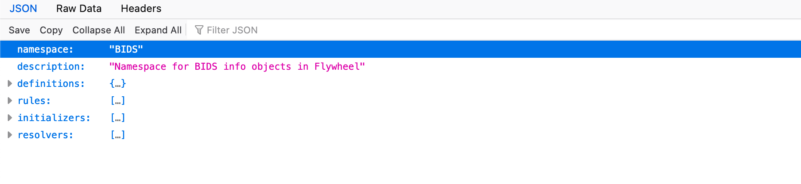
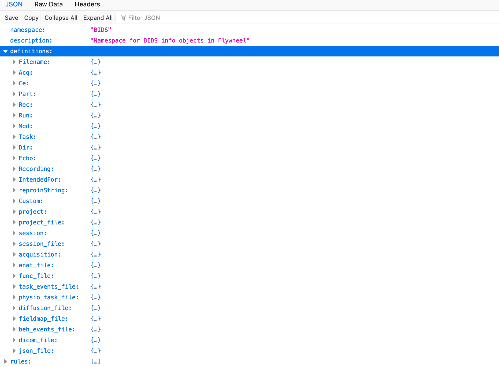
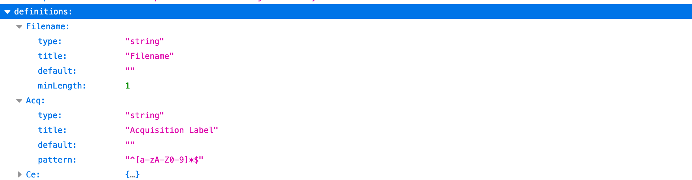
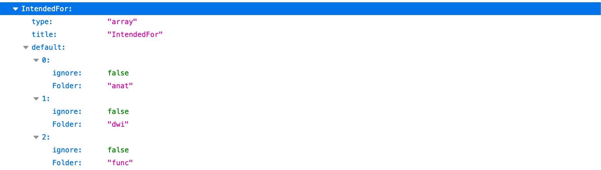
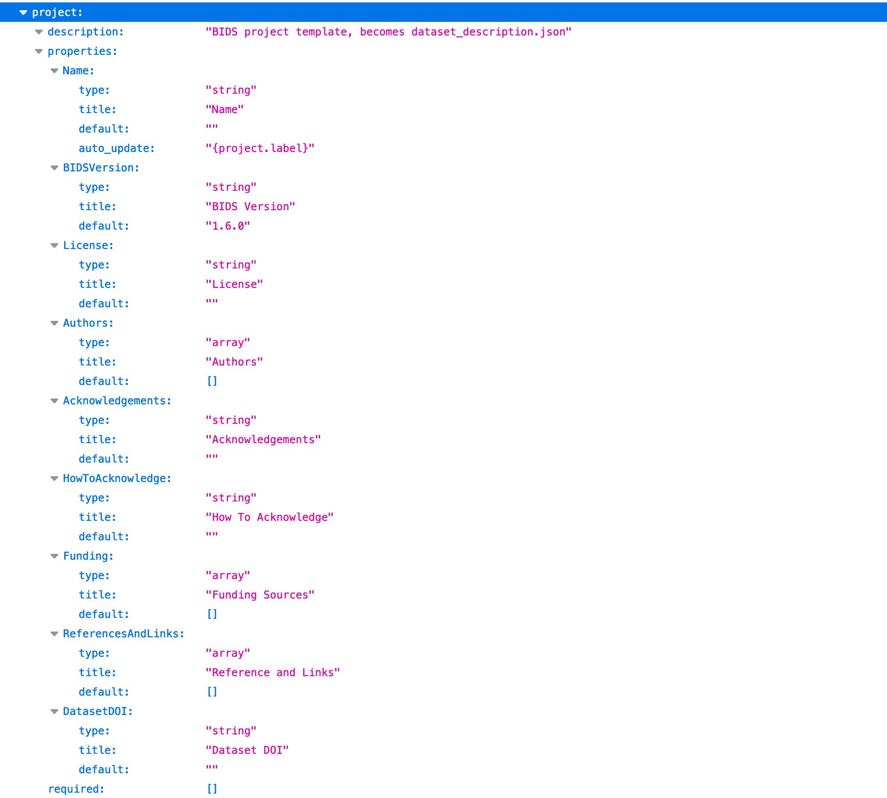

# Debug BIDS Curation

## Add an ignore rule to a template

### Project Curation Templates

On Flywheel, BUDS curation is performed using "project curation templates".  This template establishes the structure of the BIDS metadata attached to objects in the Flywheel hierarchy.  This data can be accessed in the SDK in the BIDS namespace on container and file objects.  For example, file.info.BIDS has the information that will determine how that file will be written out in BIDS format.  This data can be seen on the Flywheel platform under "Custom Information".

The project curation template is a json file that has four main sections:

#### Definitions
The "definitions" section defines how the BIDS specification will be represented in Flywheel "Custom Information" on containers and files.  The first ones shown here are simple pieces that will be assembled into more complicated representations of containers and files.

For example, "Filename" and "Acq" are strings:

While "IntendedFor" is an array (list) with a default of specific labeled booleans and strings.

The most interesting definitions are for containers and files.  
The definition for the project container will become the required BIDS file, "dataset_description.json":

An MRI Anatomical file in the BIDS Specification is defined here by "anat_file":

In the above definition under "properties", all information necessary to write out an anatomical file in BIDS format is captured. "Acq" is defined here as a reference to what was defined earlier (see "Acq" above, it is string that is made up of letters and numbers).
Note how "Acq" is used to define part of the BIDS "Filename".  The "auto_update" string will be used to set the complete file name starting with "sub-".  Optional parts are enclosed in square brackets [].  Parts enclosed in curly brackets {} will be filled in by looking at metadata that has already been found.  For "Acq", the file name will have "_acq-{file.info.BIDS.Acq}".  How to find information such as the value for `file.info.BIDS.Acq` is determined by "rules" which are in the next section of the project curation template.

#### Rules
