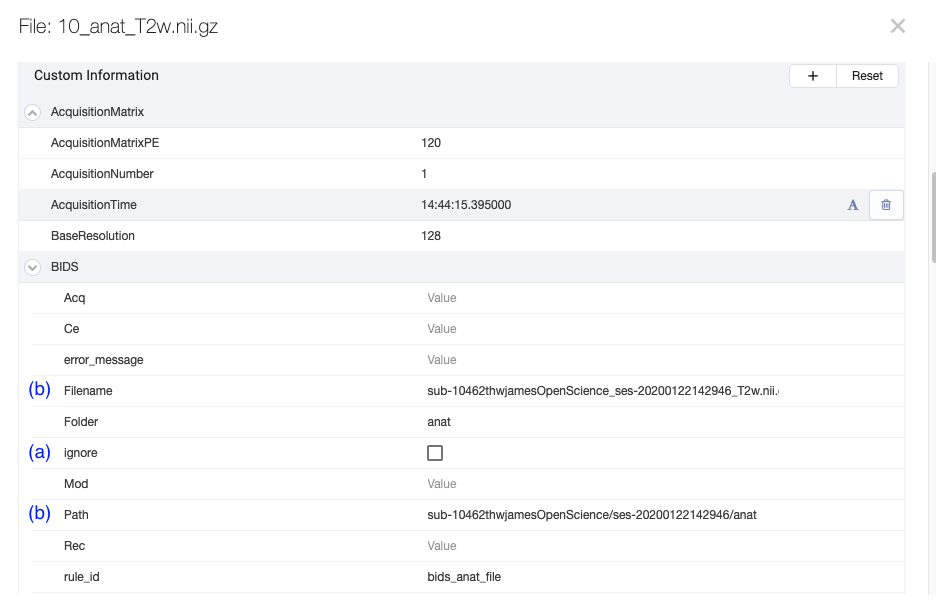

# Setting BIDS Curation Templates

## Project Curation Templates

### Eventual Representation
On Flywheel, BIDS curation is performed using "project curation templates". This type of template establishes the structure of the BIDS metadata attached to objects in the Flywheel hierarchy. Specifically, BIDS metadata typically is attached to a project, session, acquisition or file as a ".info.BIDS" field. For example, the file.info.BIDS field has the information determining (a) if the file should be ignored during curation, (b) how that file will be written out in BIDS format if not ignored, and various scan parameters used by BIDS apps. 
This data can also be accessed in the SDK in the BIDS namespace on container (i.e., project, session, etc.) and file objects.  

### How to setup the JSON
The project curation template is a json file that has four main sections:

#### Section 1: Definitions
The "definitions" section defines how the BIDS specification will be represented in Flywheel "Custom Information" on containers and files.  The first ones shown here are simple pieces that will be assembled into more complicated representations of containers and files.

For example, "Filename" and "Acq" are strings:

While "IntendedFor" is an array (list) with a default of specific, labeled booleans and strings.

The most interesting definitions are for containers and files.  
The definition for the project container will become the required BIDS file, "dataset_description.json":

To dissect an image definition, look at "anat_file". The fields here reflect an MRI Anatomical file from the BIDS Specification:

In the above definition under "properties", the information necessary to write out an anatomical file in BIDS format is captured in the "auto_update" field. Optional parts are enclosed in square brackets [].  Parts enclosed in curly brackets {} will be filled in by looking at metadata that has already been found. 
Though it looks complicated, the example reads as:
- Start with the "sub" entity. Add the subject label based on the "session.info.BIDS.Subject" field associated with the session (from Custom Info).
- If there is a session label based on the "session.info.BIDS.Label" field associated with the session (from Custom Info), add a "ses" entity.
- If there is an acquisition label from "file.info.BIDS.Acq" associated with the file (from Custom Info), add an "acq" entity.
- The definition continues to build the BIDS-formatted name in the order of the entities as specified here based on whether the field in the {} exists. If the specified field is empty, the entity is skipped.

"Acq", in the above definition of "anat_file", is a reference to "Acq" in the original "definitions" section at the top of the JSON file. (i.e., see "Acq" above, it is string that is made up of letters and numbers).
Note "Acq" in "anat_file" is used to define part of the "properites" > "Filename" definition. The "rules" section, which is examined below, provides the instructions for finding the value, `file.info.BIDS.Acq`, and populating that piece of the BIDS filename.

#### Section 2: Rules
BIDS curation with template "rules" involves traversing the Flywheel hierarchy starting at the top, project, level.  After the project itself is examined, all files attached to the project are examined. The inspection continues down the hierarchy to each subject and files attached to each subject; then, sessions and any files; and finally, acquisitions and their files.  Usually files attached to acquisitions are the main files to be put into BIDS format. 

"Rules" have two man sections, "where" and "initialize". When a rule "where" section matches, the "initialization" section is applied immediately and no other rules are examined (**_the first rule "wins" so order is important_**).

Here is the "rules" section of the project curation template.  It is a list of 11 rules and the 5th one, "reproin_anat_file" is expanded:

This rule uses the definition of the "anat_file" described above and is identified throughout curation as the "reproin_anat_file" rule.    

Here is the fully expanded "where" section of the rule:

This is a list of conditions that all have to be satisfied before this rule can be executed.

For anatomical files, the container, first and foremost, has to be a file (not a project, subject, session, or acquisition, but a file as the container_type) and it has to be a file attached to an acquisition.  The file type must be NIfTI or a JSON (source code) file and the classification "Intent" must be "Structural".  Following the ReproIn naming convention, the name must start with "anat-".

#### Section 3: Initializers
When the "where" section matches in a "rule", each part of the "initialize" section is implemented.

Here is the "initialize" section of the rule expanded with two of its sections expanded as well, "Acq" and "Modality":

This example demonstrates how the `file.info.BIDS.Acq` is set.   
- The current acquisition label is parsed by regular expression to populate the entity being defined. In this example, the text right after the string "acq-" is used for the metadata value of `file.info.BIDS.acq`.
- The regex parsing continues for all the defined entities in "initialize". In this case the final entity is "Modality".
- `file.info.MIDS.Modality` is set the matching pattern produced by the regular expression.  

#### Dismantling an acquisition label with this example initializer:
If the acquisition label is "5 - anat-T1w_acq-singleband.nii.gz", then `file.info.BIDS.Acq` would get "singleband" and `file.info.BIDS.Modality` would be "T1w".  The subject and session are found in a similar way and the final BIDS name for the NIfTI file would be something like "sub-01_ses-01_acq-singleband_T1w.nii.gz"

#### Section 4: Resolvers
Explanation coming soon.