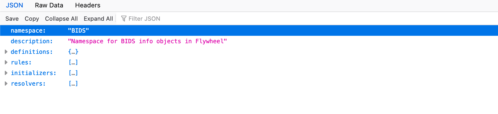
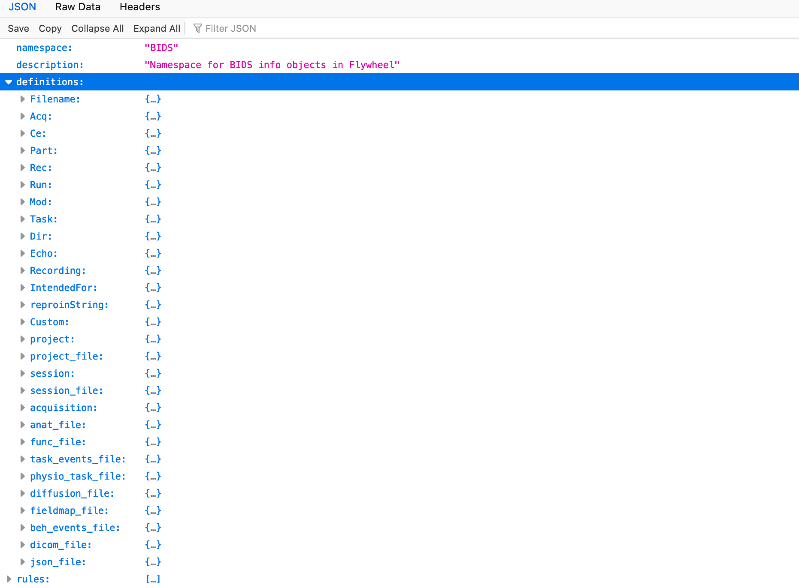
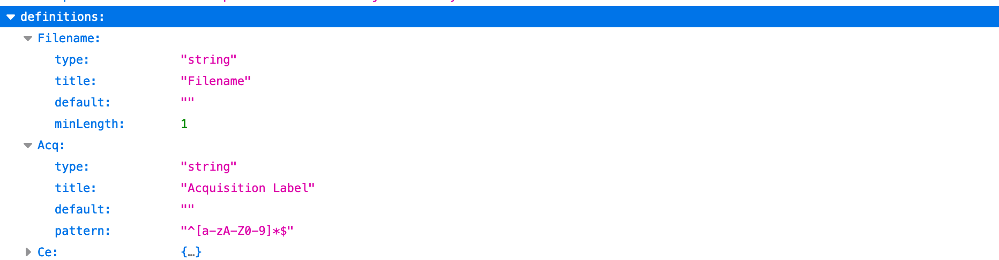
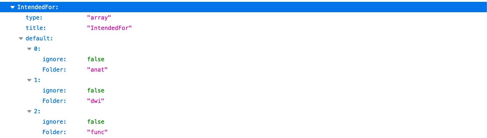
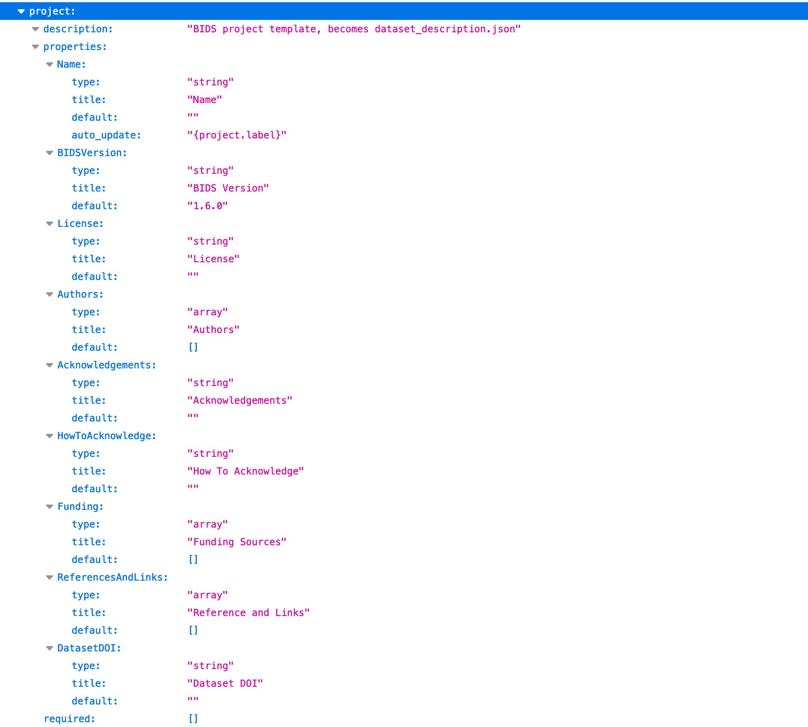
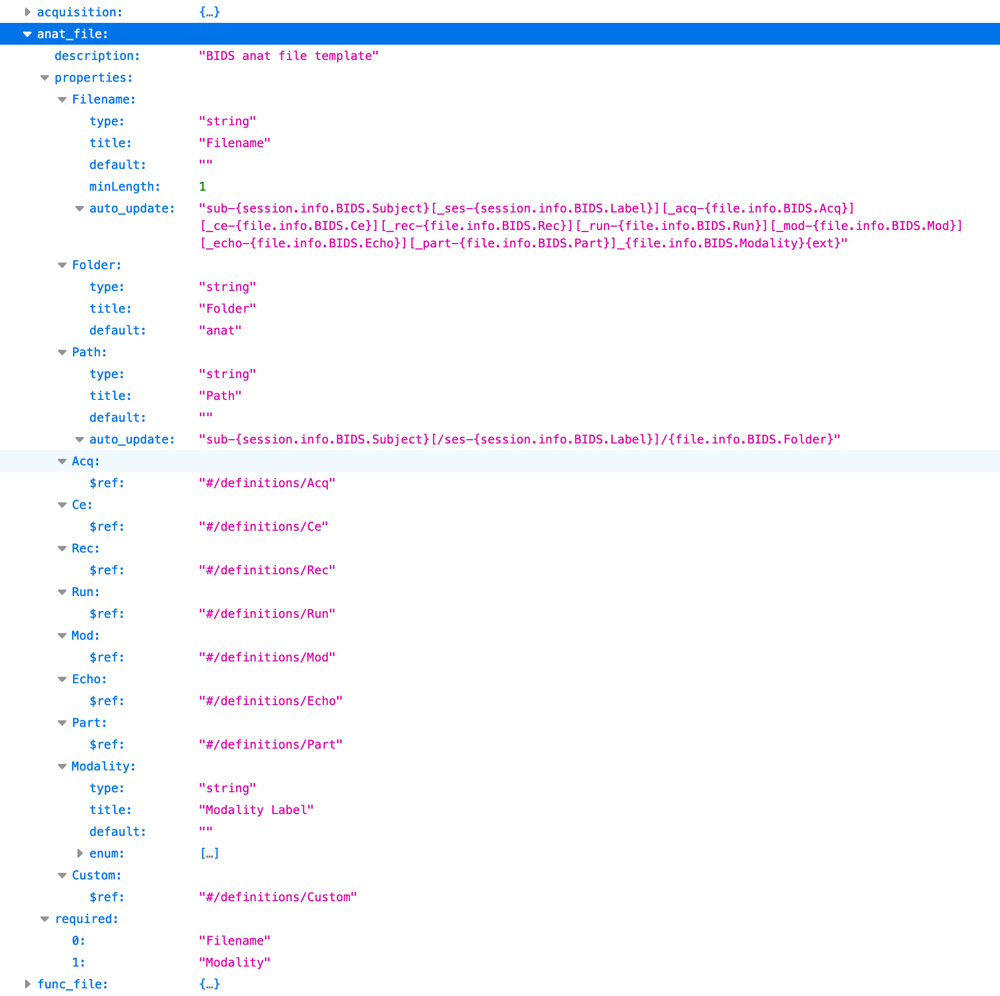
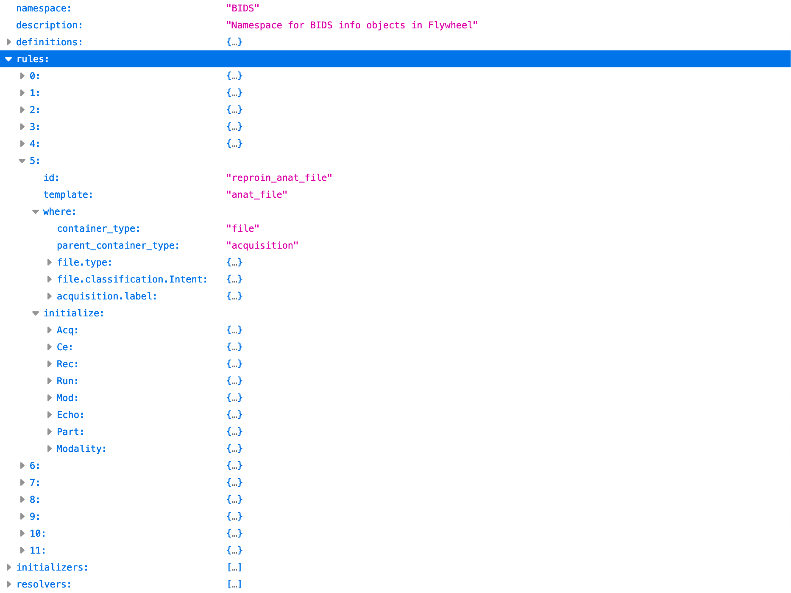
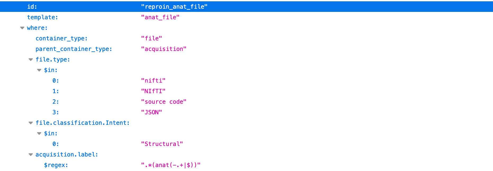
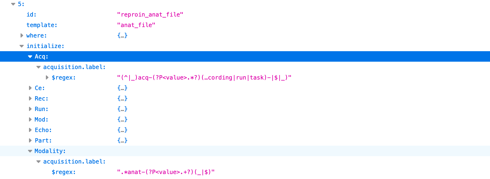

# Debug BIDS Curation

## Project Curation Templates

On Flywheel, BUDS curation is performed using "project curation templates".  This template establishes the structure of the BIDS metadata attached to objects in the Flywheel hierarchy.  This data can be accessed in the SDK in the BIDS namespace on container and file objects.  For example, file.info.BIDS has the information that will determine how that file will be written out in BIDS format.  This data can be seen on the Flywheel platform under "Custom Information".

The project curation template is a json file that has four main sections:

#### Definitions
The "definitions" section defines how the BIDS specification will be represented in Flywheel "Custom Information" on containers and files.  The first ones shown here are simple pieces that will be assembled into more complicated representations of containers and files.

For example, "Filename" and "Acq" are strings:

While "IntendedFor" is an array (list) with a default of specific labeled booleans and strings.

The most interesting definitions are for containers and files.  
The definition for the project container will become the required BIDS file, "dataset_description.json":

An MRI Anatomical file in the BIDS Specification is defined here by "anat_file":

In the above definition under "properties", all information necessary to write out an anatomical file in BIDS format is captured. "Acq" is defined here as a reference to what was defined earlier (see "Acq" above, it is string that is made up of letters and numbers).
Note how "Acq" is used to define part of the BIDS "Filename".  The "auto_update" string will be used to set the complete file name starting with "sub-".  Optional parts are enclosed in square brackets [].  Parts enclosed in curly brackets {} will be filled in by looking at metadata that has already been found.  For "Acq", the file name will have "_acq-{file.info.BIDS.Acq}".  How to find information such as the value for `file.info.BIDS.Acq` is determined by "rules" which are in the next section of the project curation template.

#### Rules

Here is the "rules" section of the project curation template.  It is a list of 11 rules and the 5th one, "reproin_anat_file" is expanded:

This rule uses the definition of the "anat_file" described above.  Rules have two man sections, "where" and "initialize".  
BIDS curation with involves traversing the Flywheel hierarchy starting at the top, project, level.  After the project itself is examined, all files attached to the project are examined, then each subject and files attached to each subject are examined, continuing to sessions and any files, and finally acquisitions and their files.  Usually files attached to acquisitions are the main files to be put into BIDS format.  When a rule "where" section matches, the "initialization" section is applied and no other rules are examined (the first rule "wins" so order is important).
Here is the fully expanded "where" section of the rule:

This is a list of conditions that all have to be satisfied before this rule can be executed.  
For anatomical files, first, the container has to be a file (not a project, subject, session, or acquisition, but a file) and it has to be a file attached to an acquisition.  The file type must be NIfTI or a JSON (source code) file and the classification "Intent" must be "Structural".  Following the ReproIn naming convention, the name must start with "anat-".

Here is the "initialize" section of the rule expanded with two of its sections expanded as well, "Acq" and "Modality":

When the "where" section matches, each part of the "initialize" section is implemented.  This is where `file.info.BIDS.Acq` is set.  The regular expression shown is applied to the current acquisition label and the text right after the string "acq-" is used for the metadata value of `file.info.BIDS.acq`.  This continues for all the items in "initialize" finishing with "Modality".  Here, `file.info.MIDS.Modality` is set the matching pattern produced by the regular expression.  For example, if the acquisition label is "5 - anat-T1w_acq-singleband.nii.gz" then `file.info.BIDS.Acq` would get "singleband" and `file.info.BIDS.Modality` would be "T1w".  The subject and session are found in a similar way and the final BIDS name for the NIfTI file would be something like "sub-01_ses-01_acq-singleband_T1w.nii.gz"