# Debug BIDS Curation

## Set up Debugger

In PyCharm, open this directory as a project.  Set the interpreter for this project by going to 
Preferences (command-comma), open "Project" and select "Project Interpreter".  Then click on the
little gear and select "Add".

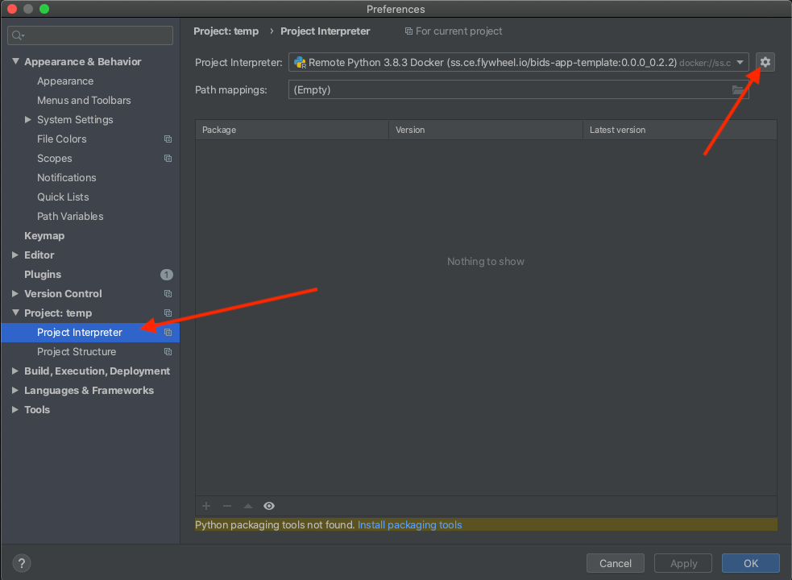

Choose "Pipenv" for the environment:

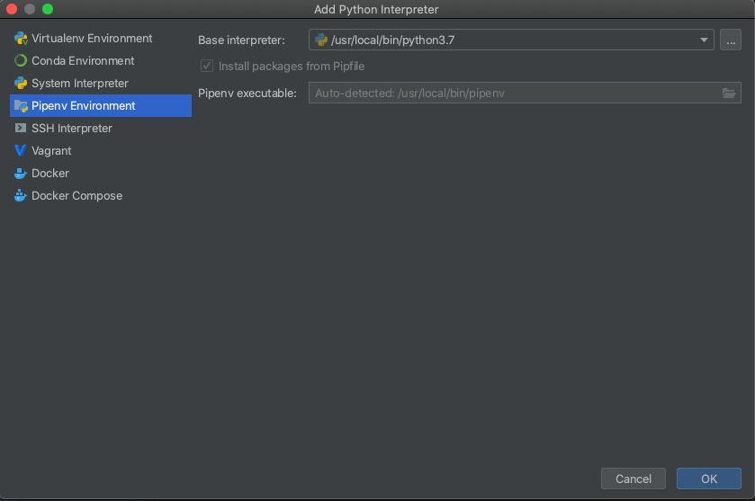

The environment will be empty at first.  Click the "+" to add a package, search for "flywheel"
and select "flywheel-bids".

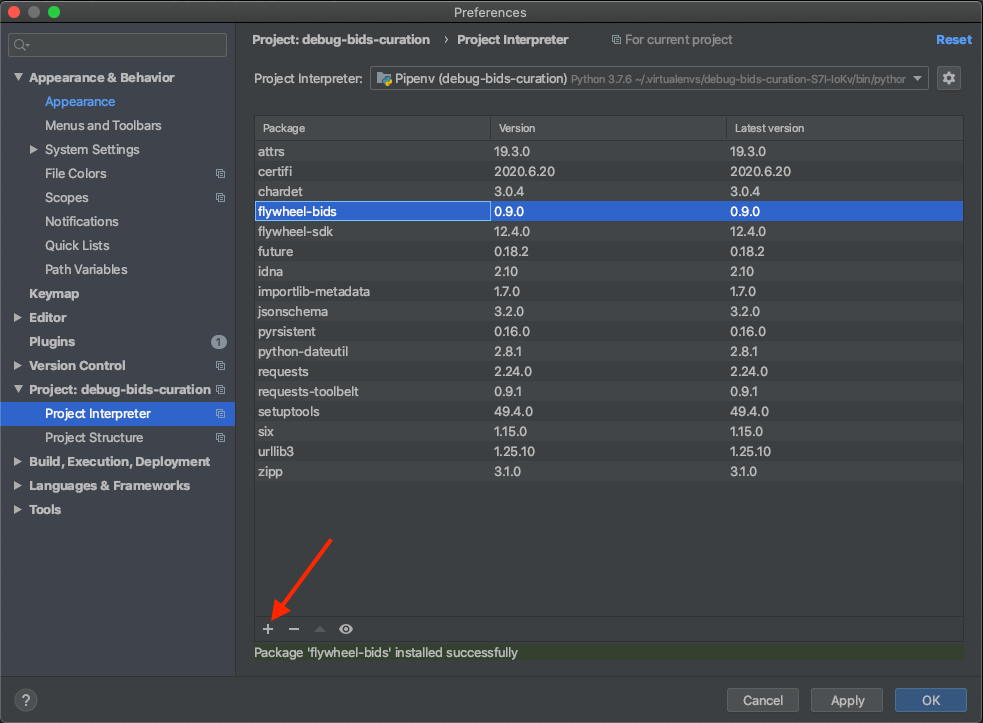

Click on the "Add Configuration..." button near the top right of the PyCharm window. 

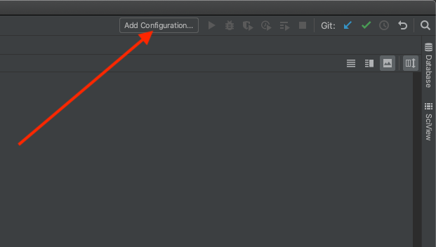

Click on the "+" and select "Python" to add a Python configuration.

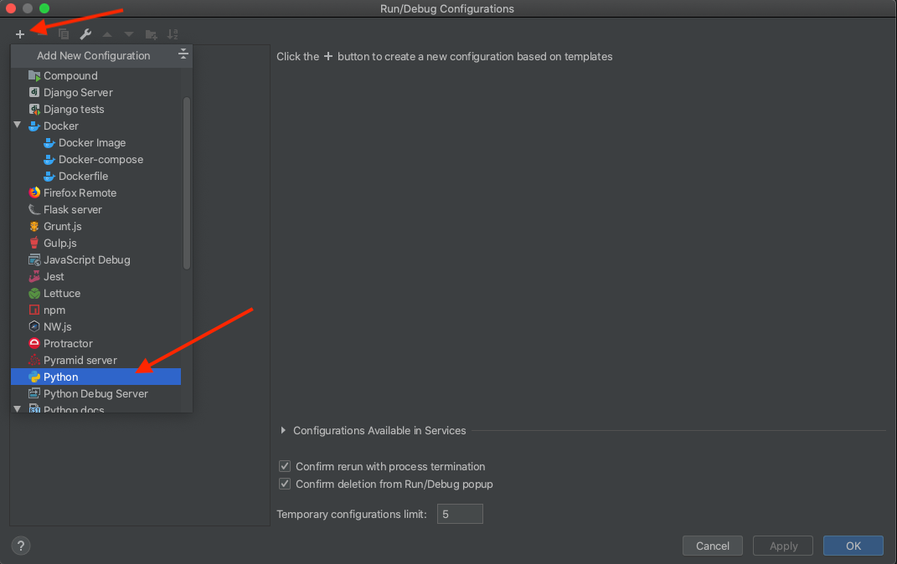

Give it a name, then set the script path:

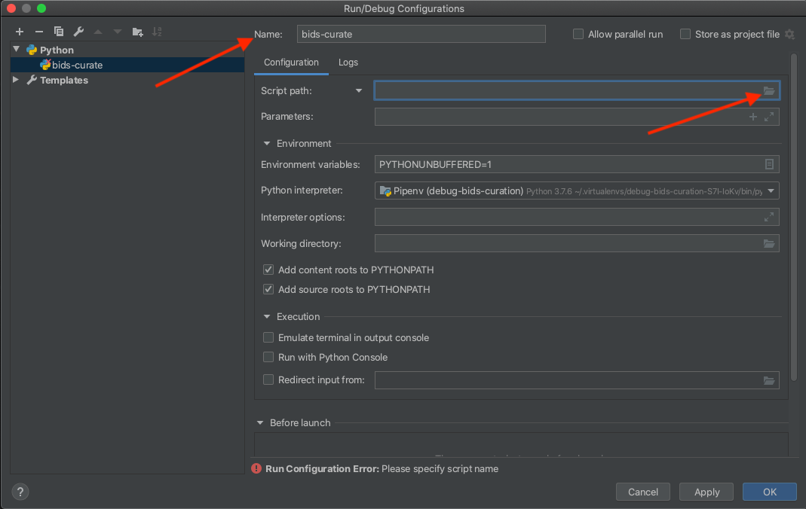

Select "runCurate.py"

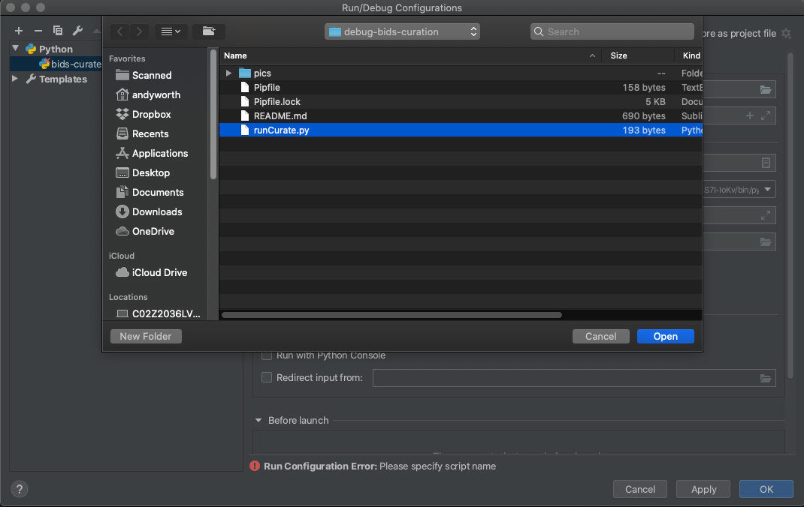

Type in parameters to pass in to [flywheel_bids/curate_bids.py](https://gitlab.com/flywheel-io/public/bids-client/-/blob/0.9.0/flywheel_bids/curate_bids.py#L252)

For example:

`--api-key ss.ce.flywheel.io:YadaYadaYadaYadaHo -p atbs-study --session-only --session 5a19c137d8e083001c0b340e --reset`

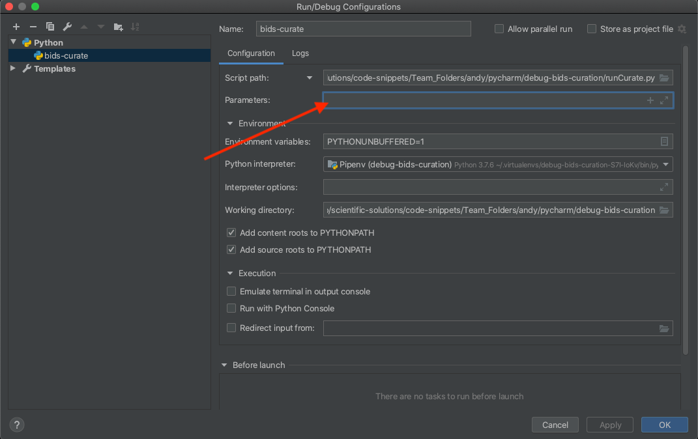

Open "runCurate.py" and set a breakpoint at "main()"

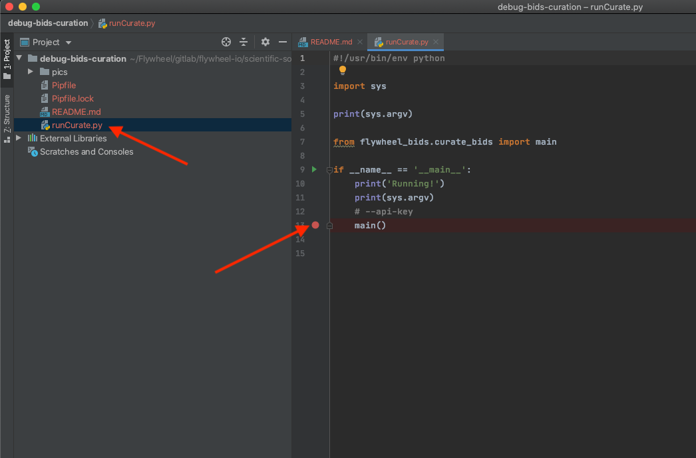

Then launch the debugger:

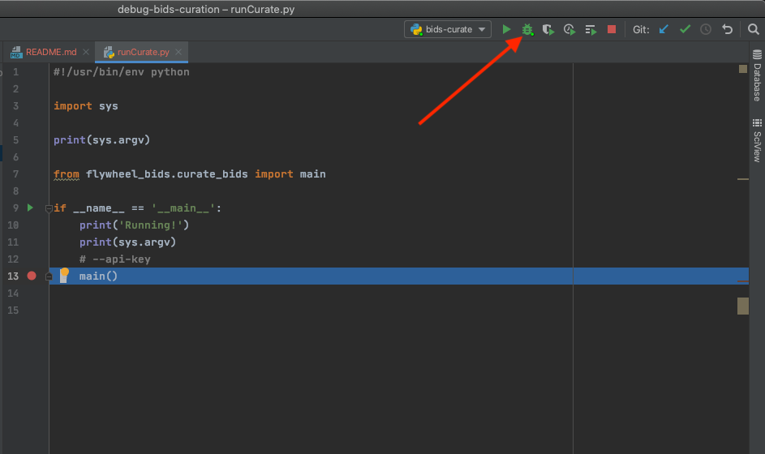

Click on the "Console" tab, and you'll see you are running, yay!

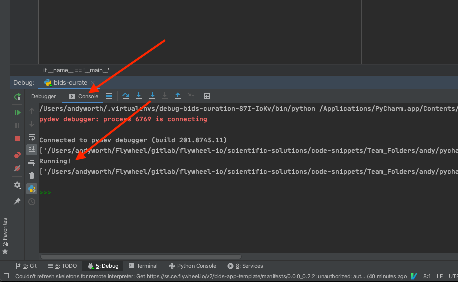

Click on the "Debugger" tab and step in by clicking on the blue down-arrow:

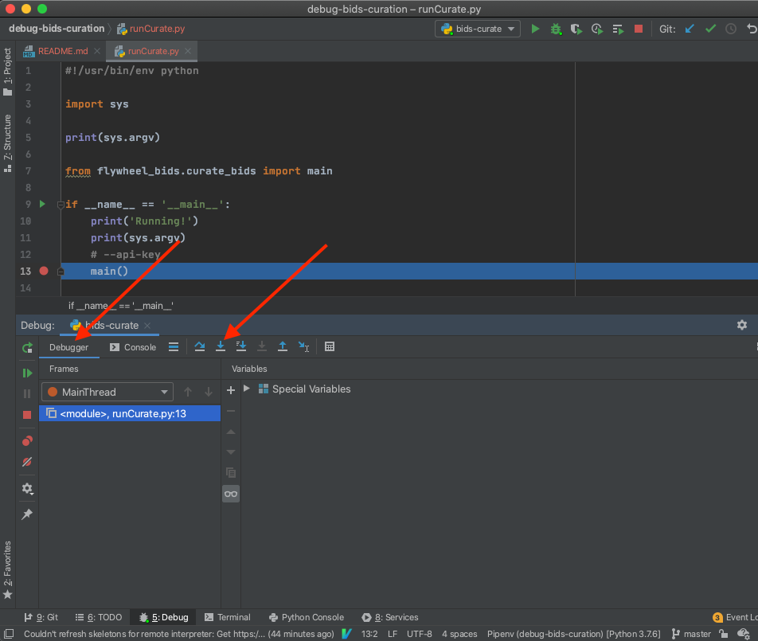

You will find yourself at the first executable line of `curate_bids.py`.  From
there, set other breakpoints and, well, you know the drill.  Squish that bug.

You can find other source files under "External Libraries"

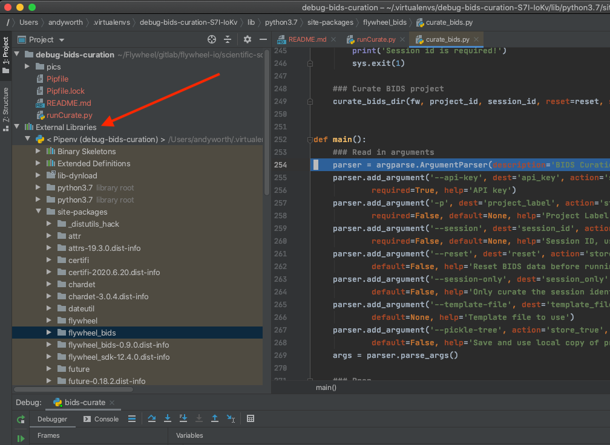
