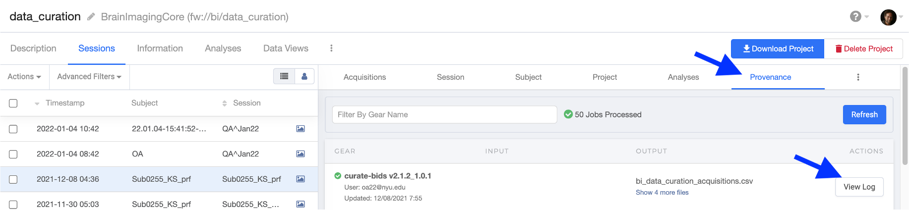

# copy-job
 
This python script can be used to re-run jobs on Flywheel.

After you have run a gear on the Flywheel platform where you have figured out the proper inputs and configuration and are happy with the results, you can easily create a python script that will re-run that job.  
You can then edit the script that is created to run on a different session or subject or put in a loop and run the gear on all sessions/subjects.

The python script to do this is called “[copy-job.py](”./copy-job.py")". 
To get it to run, you need to: 
* install the Flywheel CLI.  See “[Installing the Flywheel Command–Line Interface](https://docs.flywheel.io/hc/en-us/articles/360008162214-Installing-the-Flywheel-Command-Line-Interface-CLI-)”
* log in to the CLI: `fw login <your API key>`
* install the Flywheel SDK:  `pip install flywheel-sdk`
* install “black” (a python code formatter):  `pip install black`

Run it with the “help” argument to see how it works: 

```
% ./copy-job.py --help
usage: copy-job.py [-h] [-a] [-v] job_id

Create a python script to re-run a job given the job ID for a gear that was run on Flywheel.

positional arguments:
  job_id          Flywheel job ID

optional arguments:
  -h, --help      show this help message and exit
  -a, --analysis  ID provided is for the analysis (job destination)
  -v, --verbose
```
You need to provide the script with the job ID for the gear run that you want to copy.

You can find the job ID on the Flywheel platform by looking at the Job Log.
First, select the “Provenance” tab and find the job that you want to copy, then click on “View Log”:



Select (double-click) and copy the job number:


Run the command: 
```% copy-job.py 61b0ab1efafoa55a7a4dbff3c```

It will print what it is doing:

```
Flywheel Instance https://flywheel.yourinstance.com/api
Job ID 61b0ab1efafa55a7a4dbff3c
gear.gear.name is curate-bids
job's destination_id is 61b0ab1efafa55a7a4dbff3b type analysis
job's analysis's parent id is 61b09703877dd6f780179b7b type session
new job's destination is Sub0255_KS_prf type session
Group id: bi
Project label: data_curation
Creating script: curate-bids_session_Sub0255_KS_prf.py ...

reformatted curate-bids_session_Sub0255_KS_prf.py
All done! ✨ 🍰 ✨
1 file reformatted.
```

That sparkly cake is black formatting the script so it is readable.  The line starting with “Creating script:” provides the name of the new python script that will re-run that same job.

Here are the top lines of a script produced by copy-job.py that will run the curation gear on a subject (the previous example was for a session):
```python
#! /usr/bin/env python3
"""Run curate-bids on subject "Sub0255_KS_prf"

    This script was created to run Job ID 61c66ced5c74bb9d0df09145
    In project "bi/data_curation"
    On Flywheel Instance https://flywheel.yourinstance.com/api
"""
import os
import argparse
from datetime import datetime
import flywheel

input_files = {
    "template": {
        "container_path": "bi/data_curation",
        "location_name": "reproin.json",
    }
}
```

Note that ”input_files” specifies that the input template will be from the “bi/data_curation” group/project and is called “reproin.json”.  

The last line gives the Flywheel path to the subject.  You can edit this to make it run on a different subject or even run on the whole project by removing the subject “/Sub0255_KS_prf”:

```python
 def main(fw):
    
 gear = fw.lookup("gears/curate-bids")
    print("gear.gear.version in original job was = 2.1.2_1.0.1")
    print(f"gear.gear.version now = {gear.gear.version}")
    print("destination_id = 61b09703877dd6f780179b7a")
    print("destination type is: subject")
    destination = fw.lookup("bi/data_curation/Sub0255_KS_prf")

...
```

A bit further down in the scrip, you can see the settings in the configuration, “config”.  These can be edited as well:

```python
...

 config = {
        "base_template": "ReproIn",
        "intendedfor_regexes": "",
        "reset": True,
        "use_or_save_config": "Ignore Config File",
        "verbosity": "INFO",
    }
 
    tags = ["hpc"]

    now = datetime.now()
    analysis_label = (
        f'{gear.gear.name} {now.strftime("%m-%d-%Y %H:%M:%S")} SDK launched'
    )
    print(f"analysis_label = {analysis_label}")

    analysis_id = gear.run(
        analysis_label=analysis_label,
        config=config,
        inputs=inputs,
        destination=destination,
    )
    print(f"analysis_id = {analysis_id}")
    return analysis_id

...
```
The whole point of this script is to set up the inputs, configuration, and destination and pass those to the function “gear.run()”.


